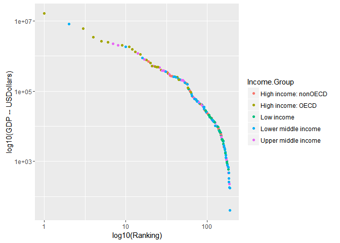

# MSDS 6306 Doing Data Science -- Case Study 1
J. Logan Gage  
November 2, 2016  

### Introduction

The following is an analysis of two data sets from the The World Bank (www.worldbank.org). The first data set contains the Gross Domestic Product data and the second contains educational data. Each sets of data are organized by country.  The purpose of this case study is to merge the data and answer serveral questions.  The following is a breakdown of the download and analysis procedures.

#### Library packages


```r
library(tidyr)
library(dplyr)
```

```
## 
## Attaching package: 'dplyr'
```

```
## The following objects are masked from 'package:stats':
## 
##     filter, lag
```

```
## The following objects are masked from 'package:base':
## 
##     intersect, setdiff, setequal, union
```

```r
library(ggplot2)
library(repmis)
library(RCurl)
```

```
## Loading required package: bitops
```

```
## 
## Attaching package: 'RCurl'
```

```
## The following object is masked from 'package:tidyr':
## 
##     complete
```

#### Downloading and Importing

The following code will locate the two data sets from The World Bank repository and download them to the working directory.


```r
site1 <- "https://d396qusza40orc.cloudfront.net/getdata%2Fdata%2FGDP.csv"
download.file(site1, destfile="./FGDP.csv")

site2 <- "https://d396qusza40orc.cloudfront.net/getdata%2Fdata%2FEDSTATS_Country.csv"
download.file(site2, destfile="./FEDSTATS.csv")
```

#### Tidying

For the Gross Domestic Prodect data only rows 6:196 are required for thsi analysis.  Also, headers must be given as there are none.  The educational data requires no modifications.


```r
FGDP <- read.csv("FGDP.csv", header=FALSE, skip=5, nrows=190)
FGDP <- FGDP[,-3]
FGDP <- FGDP[,-5:-9]
names(FGDP) <- c("CountryCode", "Ranking", "Long.Name", "USDollars")

FEDSTATS <- read.csv("FEDSTATS.csv", header=TRUE)
```

#### Question 1: Merge the data based on the country shortcode. How many of the IDs match?


```r
MergedDataID <- merge(FGDP, FEDSTATS, by="CountryCode")
nrow(MergedDataID)
```

```
## [1] 189
```

#### Question 2: Sort the data frame in ascending order by GDP (so United States is last). What is the 13th country in the resulting data frame?


```r
attach(FGDP)
FGDPAscending <- FGDP[order(-Ranking),]
detach(FGDP)
FGDPAscending[13,]
```

```
##     CountryCode Ranking           Long.Name USDollars
## 179         KNA     178 St. Kitts and Nevis      767
```

#### Question 3:  What are the average GDP rankings for the "High income: OECD" and "High income: nonOECD" groups?


```r
MergedData <- MergedDataID[,-7:-34]
MergedData$USDollars <- as.numeric(gsub(",", "", as.character(MergedData$USDollars)))

L <- MergedData$Income.Group == "High income: OECD"
SubsetOECD <- MergedData[L,]
mean(SubsetOECD$USDollars)
```

```
## [1] 1483917
```

```r
M <- MergedData$Income.Group == "High income: nonOECD"
SubsetnonOECD <- MergedData[M,]
mean(SubsetnonOECD$USDollars)
```

```
## [1] 104349.8
```

#### Question 4:  Plot the GDP for all of the countries. Use ggplot2 to color your plot by Income Group.


```r
p <- ggplot(MergedData, aes(x=Ranking, y=USDollars, color=Income.Group)) + geom_point()
pgraph <- p + scale_x_log10()
pgraph <- pgraph + scale_y_log10()
pgraph <- pgraph + xlab("log10(Ranking)")
pgraph <- pgraph + ylab("log10(GDP -- USDollars)")
pgraph
```

<!-- -->

Income groups are measured as a ratio of Gross National Income per capita.  This logarithmic interpretation of the data suggests an exponential decrease in GDP as a country moves down in the Rankings. Also, the income groupings follow a similar pattern of lower GDP and income level.  However, China, with a GDP Ranking of 2, is listed as a Lower Middle Income country and not part of the collection of fellow countries down the curve.  On the other end of the sprectrum, the Republic of Palau is an Upper Middle Income country but with a very low GDP ranking.  The population differences between these countries could explain this as China has a 6429 to 1 population ratio to Palau.


#### Question 5:  Cut the GDP ranking into 5 separate quantile groups. Make a table versus Income.Group. How many countries are Lower middle income but among the 38 nations with highest GDP?


```r
DoQuantiles <- function(x) {
cut(x, breaks=c(quantile(MergedData$USDollars, probs=seq(0,1, by = 0.20))),
labels=c("0-20", "20-40", "40-60", "60-80", "80-100"), include.lowest=TRUE)
}
MergedData$Quantiles <- sapply(MergedData$USDollars, DoQuantiles)
income <- table(MergedData$Income.Group, MergedData$Quantiles)
income <- addmargins(income, FUN = list(Total = sum), quiet = TRUE)
income
```

```
##                       
##                        0-20 20-40 40-60 60-80 80-100 Total
##                           0     0     0     0      0     0
##   High income: nonOECD    2     4     8     5      4    23
##   High income: OECD       0     1     1    10     18    30
##   Low income             11    16     9     1      0    37
##   Lower middle income    16     9    11    13      5    54
##   Upper middle income     9     8     8     9     11    45
##   Total                  38    38    37    38     38   189
```

```r
income['Lower middle income', '80-100']
```

```
## [1] 5
```


